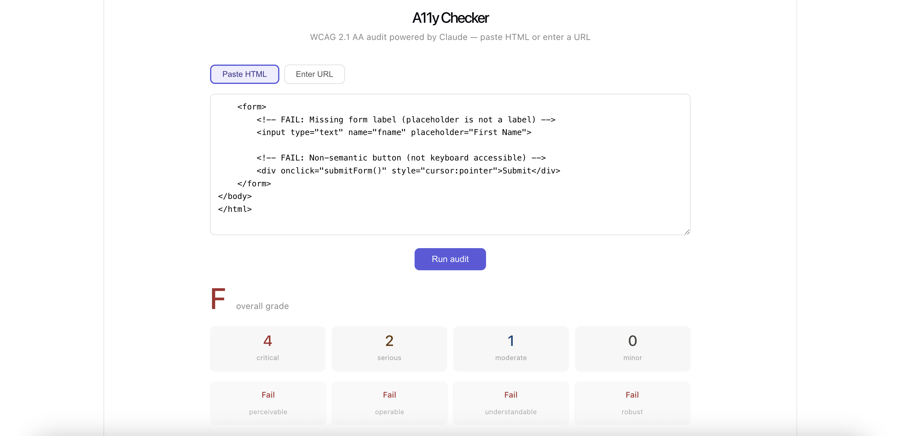

# A11y Checker

A WCAG 2.1 AA accessibility auditor powered by Claude AI. Paste HTML or enter a URL to get instant violation reports with severity ratings and diff-ready fix suggestions.

**Live demo → [a11y-checker-gamma.vercel.app](https://a11y-checker-gamma.vercel.app)**



---

## Features

- **Two input modes** — paste HTML directly or enter any public URL
- **WCAG 2.1 AA coverage** — checks all four principles: Perceivable, Operable, Understandable, Robust
- **Severity classification** — issues rated as critical, serious, moderate, or minor
- **Diff-ready fixes** — every issue shows the broken snippet alongside the corrected replacement
- **Overall grade** — A/B/C/F grade with a per-principle pass/fail breakdown
- **Secure by design** — API key never touches the browser; all Claude calls go through a Vercel serverless function

---

## Tech stack

| Layer | Technology |
|---|---|
| Frontend | React + TypeScript + Vite |
| AI | Claude claude-sonnet-4-5 (Anthropic API) |
| Backend | Vercel Serverless Functions |
| Deployment | Vercel |

---

## Getting started locally

### Prerequisites

- Node.js 18+
- An [Anthropic API key](https://console.anthropic.com)

### Installation

```bash
git clone https://github.com/sinhapiya123/a11y-checker.git
cd a11y-checker
npm install
```

### Environment setup

Create a `.env` file in the root:

```
ANTHROPIC_API_KEY=your-key-here
```

### Run locally

```bash
npx vercel dev
```

Visit `http://localhost:3000`

---

## Project structure

```
a11y-checker/
├── api/
│   ├── audit.ts          # Serverless function — calls Claude API
│   └── fetch-url.ts      # Serverless function — fetches URLs server-side
├── src/
│   ├── components/
│   │   ├── AuditForm.tsx  # HTML paste / URL input
│   │   ├── AuditResult.tsx# Grade, summary, issue list
│   │   └── IssueCard.tsx  # Single issue with broken/fixed diff
│   ├── lib/
│   │   └── auditor.ts     # API call logic
│   ├── types.ts           # Shared TypeScript types
│   └── App.tsx
├── .env.example
└── vite.config.ts
```

---

## How it works

1. User pastes HTML or enters a URL
2. If a URL is entered, `api/fetch-url.ts` fetches the page server-side (bypassing CORS)
3. The HTML is sent to `api/audit.ts` which calls Claude with a structured WCAG audit prompt
4. Claude returns a JSON audit report — grade, principle scores, and per-issue fixes
5. The frontend renders the results with severity-coded issue cards

---

## Deploying your own instance

1. Fork this repo
2. Import it in [Vercel](https://vercel.com)
3. Add `ANTHROPIC_API_KEY` in Project Settings → Environment Variables
4. Deploy — done

---

## WCAG criteria covered

The auditor checks for violations across all four WCAG 2.1 principles including missing alt text (1.1.1), insufficient color contrast (1.4.3), missing form labels (1.3.1), keyboard inaccessibility (2.1.1), missing focus indicators (2.4.7), invalid ARIA usage (4.1.2), missing language attribute (3.1.1), and more.

---

## Author

**Piya Sinha** — [github.com/sinhapiya123](https://github.com/sinhapiya123)

---

## License

MIT
